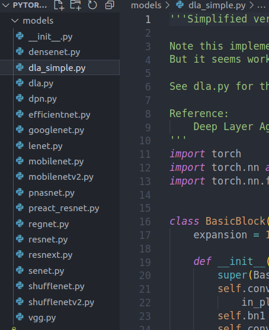

# Orientação a Objetos em Python e suas Aplicações no Deep Learning
" Deep learning ou aprendizagem profunda baseia-se no machine learning para, a partir de uma grande quantidade de dados e após inúmeras camadas de processamento com algoritmos, conseguir que um computador aprenda por si mesmo e execute tarefas semelhantes às dos seres humanos, tais como a identificação de imagens, o reconhecimento de voz ou a realização de predições, de forma progressiva."  - [IBERDROLA](https://www.iberdrola.com/inovacao/deep-learning)

## OOP em Python
Antes de introduzir o uso de Orientação a Objetos no Deep Learning em Python, precisamos saber como exatamente a linguagem por si só trabalha com o Paradigma.

**Obs.:** Ao chegar aqui, imaginamos que você já tenha noções básicas sobre Orientação a Objeto num geral, logo não nos extenderemos neste sentido e iremos direto aos pontos:

### Declaração de Classes:
Para declarar uma classe em Python é bem simples:  
```
class PessoaFisica():
    # Atributos e métodos da classe
```
No Python, todas as classes devem, por boas práticas, possuir nomes que **comecem com letra maiúscula** e, caso sejam compostos, a primeira letra de cada palavra deve ser maiúscula, o que chamamos de formato ``CamelCase``.

### Criando um Construtor:
Para declarar um construtor em Python basta definir o nome do atributo no método especial chamado ``__init__``, este método define o **construtor da classe**.  

Para definir os atributos de uma classe em seu construtor, basta passá-los como parâmetro, como podemos ver abaixo:
```
class PessoaFisica:
    def __init__(self, nome, sexo, cpf):
        self.nome = nome
        self.sexo = sexo
        self.cpf = cpf
```
Observe que o uso de ``self.atributo`` se parece com o uso de ``this.atributo`` em Java.

### Instanciando Objetos:
Parecido com Java, para instanciar um objeto em Python basta:
```
if __name__ == "__main__":
    pessoa1 = PessoaFisica("João", "M", "123456")
```

### Declarando Métodos:
Um dos principais aspectos de qualquer linguagem é a declaração de Métodos/Funções para fazer o que precisamos dentro do nosso programa. Em Python não é diferente. Para **declarar um método** dentro de uma classe em Python é simples: 

```
class PessoaFisica:
    def __init__(self, nome, sexo, cpf, ativo):
        self.nome = nome
        self.sexo = sexo
        self.cpf = cpf
        self.ativo = ativo
        
    def desativar(self):
        self.ativo = False
        print("A pessoa foi desativada com sucesso")

if __name__ == "__main__":
    pessoa1 = PessoaFisica("João", "M", "123456", True)
    pessoa1.desativar()
```

Para criar um método utilizamos a palavra reservada ``def`` seguido do nome da classe, nesse caso ``desativar``. Após isso é só definir o comportamente deste método. Neste caso estamos desativando a ``PessoaFisica`` em questão.

### Encapsulamento em Python
Um dos pilares da OOP é o encapsulamento, e é claro que há implementação de tal pilar em Python. Porém ela aparece de forma um pouco diferente quando comparada a linguagens de paradigma totalmente voltado para OOP.

#### Definir Atributo como Privado:
Utilizamos dois underlines ``__`` antes do nome do atributo ou método: 
```
class PessoaFisica:
    def __init__(self, nome, sexo, cpf, ativo):
        ...
        self.__ativo = ativo
        
    def desativar(self):
        self.__ativo = False
        print("A pessoa foi desativada com sucesso")

if __name__ == "__main__":
    pessoa1 = PessoaFisica("João", "M", "123456", True)
    pessoa1.desativar()
    print(pessoa1.ativo)
```

Podemos utilizar Getters e Setters para modificar estes atributos, porém, os criadores da linguagem desenvolveram uma forma alternativa de fazer isso: as **Properties**.
```
class PessoaFisica:
    def __init__(self, nome, sexo, cpf, ativo):
        self.__nome = nome
        self.__sexo = sexo
        self.__cpf = cpf
        self.__ativo = ativo

    @property
    def nome(self):
        return self.__nome
    
    @nome.setter
    def nome(self, nome):
        self.__nome = nome

if __name__ == "__main__":
    pessoa1 = PessoaFisica("João", "M", "123456", True)
    # Utilizando properties
    pessoa1.nome = "José"
    print(pessoa1.nome)
```

A utilização continua a mesma, o que torna tudo mais limpo!


## Deep Learning e OOP
Uma das áreas de maior interesse de quem vós fala é o Machine Learning, o que se reflete diretamente no tema deste trabalho. Ao efetuar uma pesquisa **profunda** na internet, pude constatar que o uso de OOP é viável no desenvolvimento de modelos de Deep Learning em Python. Podemos ver a prática como uma alternativa às implementações normalmente utilizadas, e que até, em algumas cituações, pode haver preferência por tal. Neste tópico, venho mostrar um exemplo de modelo de Deep Learning que utiliza Orientação a Objetos em sua estrutura, que é utilizado basicamente para Identificação de Objetos em imagens utilizando [CIFAR10](https://www.cs.toronto.edu/~kriz/cifar.html). Todos os modelos disponíveis (inclusive este) e mais detalhes sobre estão disponíveis em: [Train CIFAR10 with PyTorch](https://github.com/kuangliu/pytorch-cifar)

### Exemplo de uso de OOP em modelos de Deep Learning
A principal característica da utilização de Orientação a Objetos em projetos de Deep Learning é a transformação de cada modelo em Classes separadas em diferentes arquivos: 



Como podemos ver, cada arquivo é um modelo de Deep Learning.

Utilizaremos o modelo [SimpleDLA](dla_simple.py), que encontramos em [Train CIFAR10 with PyTorch](https://github.com/kuangliu/pytorch-cifar) como exemplo:


```
class SimpleDLA(nn.Module):
    def __init__(self, block=BasicBlock, num_classes=10):
        super(SimpleDLA, self).__init__()
        self.base = nn.Sequential(
            nn.Conv2d(3, 16, kernel_size=3, stride=1, padding=1, bias=False),
            nn.BatchNorm2d(16),
...
        self.layer3 = Tree(block,  32,  64, level=1, stride=1)
        self.layer4 = Tree(block,  64, 128, level=2, stride=2)

    def forward(self, x):
        out = self.base(x)
        out = self.layer1(out)
...
```
Logo na classe principal percebemos diversos elementos de Orientação a objetos no código:
- A classe SimpleDLA (é a classe principal, que responde pelo modelo por si só);
- Definição de construtor em ``def __init__...``
- Herança de Classes na utilização de ``super(SimpleDLA, self).__init__()``, [Herança em Python](https://www.treinaweb.com.br/blog/utilizando-heranca-no-python); 
- Instanciamento do Objeto Tree em ``self.layer3 = Tree(bl...``;
- Definição de método em ``def forward(...``.

Por fim, caso você tenha interesse em analisar o [código](dla_simple.py) como um todo, percebe-se a utilização de **Agregação**. A classe ``SimpleDLA`` instancia ``Tree`` que instancia ``Root``. 
  
### Vantagens do uso de OOP
- Melhor organização do código em projetos grandes;
- Torna o código mais legível para outros programadores;
- Torna mais fácil a transição entre diferentes modelos;

## Créditos
- [Object-Oriented Programming for Deep Learning](https://www.youtube.com/watch?v=QQkUoE58QMA&ab_channel=ConnorShorten)
- [Train CIFAR10 with PyTorch](https://github.com/kuangliu/pytorch-cifar)
- [Orientação a objetos em Python](https://www.treinaweb.com.br/blog/orientacao-a-objetos-em-python#:~:text=No%20paradigma%20orientado%20%C3%A0%20objetos,constante%20no%20desenvolvimento%20de%20programas.&text=Como%20vimos%20acima%2C%20para%20declarar,seguido%20do%20nome%20desta%20classe.)


